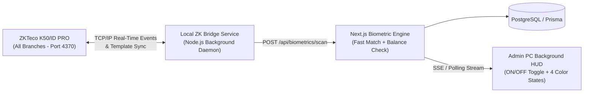

# Biometric Fingerprint Attendance & Balance Verification Specification

> **Hardware Target:** ZKTeco K50 / ID PRO (TCP/IP Port 4370)  
> **Core Purpose:** Ultra-fast, zero-bottleneck live attendance taking and student credit/balance verification across all branches.

---

## 1. Core Objectives & Operational Constraints

1. **Single Focused Purpose:**
   - Automatically record student attendance (`PRESENT`) in their exact upcoming lesson and verify their remaining session credit balance.
2. **High-Pressure Rush Hour Performance:**
   - Must handle peak congestion effortlessly (e.g., a branch like **Annex** with all 5 classrooms filled simultaneously at the same hour, with 80–120+ students scanning in random order).
   - Zero bottleneck (`< 100ms` server processing time per scan), zero race conditions, and zero duplicate records.
3. **One-Time Cross-Branch Enrollment:**
   - A student's fingerprint is recorded **only once** via a dedicated button in the Student Form (`StudentForm.tsx`).
   - Once enrolled at any branch, the student's biometric template is stored centrally in PostgreSQL and synced across all branch K50 devices (mapped via `Student.globalNumber`).
   - The student can scan at **any branch** where they have an upcoming lesson and be recognized immediately.
4. **Non-Intrusive Background Execution on Admin PC:**
   - Runs as a background service/listener inside the web application.
   - Includes an **ON / OFF Toggle** accessible from any screen.
   - Never blocks, slows down, or interrupts normal admin tasks (creating vouchers, editing students, browsing timetables, etc.).

---

## 2. Lesson Matching & Time-Window Rules

### 2.1. The Continuous Scan Window (30 Minutes Before Start $\rightarrow$ Until Next Group's Scan Window Begins)
A lesson's biometric scan window starts **30 minutes before `lesson.startsAt`**, remains open **all along the lesson** (to accommodate late students), and ends **at the exact moment the next group's scan window begins** ($30\text{ minutes}$ before the next slot's start time, i.e., `lesson.endsAt - 30 minutes` for back-to-back lessons):

$$\text{scanWindowStart} = \text{lesson.startsAt} - 30\text{ minutes}$$
$$\text{scanWindowEnd} = \text{nextSlotStartsAt} - 30\text{ minutes} \quad (\text{typically } \text{lesson.endsAt} - 30\text{ minutes})$$

$$\text{scanWindowStart} \le \text{scanTime} < \text{scanWindowEnd}$$

#### Visual Timeline Example (08:00–10:00 Lesson followed by 10:00–12:00 Lesson):
```text
07:30 AM          08:00 AM                     09:30 AM          10:00 AM                     11:30 AM
  |---- Pre-Scan ----|------ Late Arrival --------|---- Pre-Scan ----|------ Late Arrival --------|
  |<========= GROUP 1 SCAN WINDOW OPEN ==========>|<========= GROUP 2 SCAN WINDOW OPEN ==========>|
  (07:30 AM  --->  all along Group 1  ---> 09:30 AM) (09:30 AM  --->  all along Group 2  ---> 11:30 AM)
```
- **Why this boundary is zero-conflict:**
  - If a student in Group 1 (`08:00–10:00`) arrives early at `07:35 AM`, on time at `08:00 AM`, or late at `08:50 AM` / `09:20 AM`, they are still inside Group 1's window (`07:30 AM – 09:30 AM`) and get marked `PRESENT` in Group 1.
  - At `09:30 AM` sharp, Group 1's scan window closes and Group 2's (`10:00–12:00`) scan window opens (`09:30 AM – 11:30 AM`). There is **zero gap** and **zero overlap** between back-to-back groups.

### 2.2. Multi-Group & Random Order Scenarios
- **Scenario A — Interleaved Students from Different Groups at the Same Hour:**
  - Group 1 starts at `08:00 AM` (Classroom 1) and Group 3 starts at `08:00 AM` (Classroom 3).
  - Student A (enrolled in Group 1) scans at `07:42:10`, followed 1 second later by Student B (enrolled in Group 3) at `07:42:11`.
  - **Expected Result:** Student A is marked `PRESENT` strictly in Group 1 (`08:00 AM`). Student B is marked `PRESENT` strictly in Group 3 (`08:00 AM`).
- **Scenario B — Same Student Enrolled in Back-to-Back Groups (08:00–10:00 & 10:00–12:00):**
  - Student X is enrolled in **Group 1 (`08:00 AM – 10:00 AM`)** and **Group 2 (`10:00 AM – 12:00 PM`)**.
  - **First Scan (between `07:30 AM` and `09:29:59 AM`, e.g., at `07:45 AM` or late at `08:40 AM`):**
    - Matched strictly to **Group 1 (`08:00 AM`)**. Group 2 (`10:00 AM`) remains untouched.
  - **Second Scan (starting at `09:30:00 AM` onwards, when Group 2's scan window begins):**
    - Student X **must scan again** at or after `09:30 AM` to be marked `PRESENT` in **Group 2 (`10:00 AM`)**.
- **Scenario C — Student Enrolled in Two Overlapping Lessons at the Same Hour (Edge Case):**
  - If a student somehow has two enrolled lessons both within the active window, the engine selects the lesson whose `startsAt` is closest to `scanTime` (prioritizing the one not yet marked `PRESENT`).
- **Scenario D — Duplicate Scan Prevention (Idempotency):**
  - If Student A scans at `07:40 AM` for Group 1 (`08:00 AM`) and scans again at `08:15 AM`:
  - The system detects they are already marked `PRESENT` for Group 1 (`08:00 AM`), does **not** create a duplicate record or deduct extra credit, and displays an `"Déjà pointé (Présent)"` status on the Admin screen.

---

## 3. Credit & Balance Verification Logic

When a student's upcoming lesson is matched, the system calculates their remaining session balance for that specific class using `studentBilling.ts` (`computeStudentConsumedSessions` & `Voucher` cycles):

1. **Total Purchased Sessions:** Sum of sessions from valid `Voucher` records for `(studentId, classId)`.
2. **Consumed Sessions:** Computed via `computeStudentConsumedSessions` (accounting for `isFree` lessons, `NOT_DEFINED` excused absences, `PRE_START_ABSENCE`, and `PRESENT` sessions).
3. **Remaining Credits:**
   $$\text{remainingSessions} = \text{totalPurchasedSessions} - \text{consumedSessions}$$
   *(Note: Students with `payerStatus === "NON_PAYER"` are exempt from payment blocking).*
4. **Decision:**
   - **If `remainingSessions > 0` (or `NON_PAYER`):**
     - Mark `Attendance` as `PRESENT` for that lesson.
     - Return status: **`SUCCESS`** (Green).
   - **If `remainingSessions <= 0` (and not `NON_PAYER`):**
     - Do **not** silently let them pass unnoticed — trigger **`NO_CREDITS`** alert (Red) so the admin knows immediately that the student's balance is exhausted.
     - *(Configurable policy: either record attendance as `PRESENT` with an urgent unpaid flag or hold attendance until admin confirms/collects payment).*

---

## 4. Visual & Status Feedback States (4 States)

Every scan produces one of four deterministic states displayed in real time on the Admin PC Live Monitor (and signaled via sound/device feedback):

| State Code | Condition | Visual Indicator Pattern | Admin Screen Display |
| :--- | :--- | :--- | :--- |
| **`SUCCESS`** | Student recognized + Active/Upcoming group found + Credits available | 🟢 **Solid Green** | Student Name, Group Name, Classroom, Remaining Credits (`e.g. 3 séances restantes`) |
| **`NO_CREDITS`** | Student recognized + Active/Upcoming group found + **0 Credits left** | 🔴 **Solid Red** | Student Name, Group Name, **"Solde épuisé (0 séances) — Paiement requis"** |
| **`NO_UPCOMING_GROUP`** | Student recognized + **No enrolled lesson** in current scan window | 🟢➡️🔴 **Flash Green then Red** | Student Name, `globalNumber`, **"Aucune séance prévue dans ce créneau"** |
| **`UNRECOGNIZED`** | Fingerprint not found / not registered in system | 🔴➡️🟢 **Flash Red then Green** | **"Empreinte non reconnue — Étudiant non enregistré"** |

### Hardware Note on ZKTeco K50/ID PRO LED Behavior
- **Internal K50 Firmware Behavior:** The ZKTeco K50 has an autonomous onboard chip that controls its physical LED light the instant a finger touches the prism (flashing Green if the finger template exists in memory, or Red if unknown) *before* sending data over the network. The K50 hardware firmware does not expose an open TCP command to blink custom alternating two-color sequences (`Green->Red` or `Red->Green`) on the physical plastic casing.
- **How We Achieve This:**
  1. **On the Admin PC Background Monitor:** The exact 4 visual states (**Solid Green**, **Solid Red**, **Flashing Green-then-Red**, **Flashing Red-then-Green**) along with 4 distinct audio tones are rendered instantaneously (`< 0.2s`) in the floating Live Attendance HUD.
  2. **On the K50 Hardware:** We can trigger the K50 internal buzzer/beep patterns via TCP (`CMD_BELL` / status response) to alert the student/admin physically when an error state (`NO_CREDITS` or `NO_UPCOMING_GROUP`) occurs.

---

## 5. Student Form Fingerprint Enrollment Workflow

Inside `src/components/forms/StudentForm.tsx`:
1. **UI Control:**
   - A new section/button: **"Enregistrer l'empreinte / تسجيل البصمة"** (or **"Mettre à jour l'empreinte / تحديث البصمة"** if already enrolled, with a green badge indicating `"Empreinte enregistrée ✓"`).
2. **Enrollment Flow:**
   - Admin clicks **"Enregistrer l'empreinte"** in the student modal.
   - The app communicates with the local branch's K50 device (via the local bridge) using the student's `globalNumber`.
   - Student places their finger 3 times on the K50 sensor (or if enrolled directly on the K50 keypad under `User ID = globalNumber`, the app pulls the template via **"Synchroniser depuis l'appareil"**).
   - The fingerprint template is saved in the PostgreSQL database (`StudentFingerprint` table) and automatically pushed to all connected K50 devices across all branches.

---

## 6. Technical Architecture



### 6.1. Database Schema Additions (`prisma/schema.prisma`)
- **`BiometricDevice`**: Tracks each branch's K50 terminal (`id`, `name`, `branchId`, `ipAddress`, `port`, `serialNumber`, `isActive`, `lastSeenAt`).
- **`StudentFingerprint`**: Stores the student's central biometric template (`id`, `studentId`, `globalNumber`, `fingerIndex`, `templateData`, `updatedAt`) so templates sync across all branches.
- **`BiometricScanLog`**: High-speed log of every scan (`id`, `deviceId`, `branchId`, `globalNumber`, `studentId`, `lessonId`, `status` [`SUCCESS`, `NO_CREDITS`, `NO_UPCOMING_GROUP`, `UNRECOGNIZED`, `DUPLICATE`], `remainingCredits`, `scannedAt`).

### 6.2. Performance & Concurrency Guarantees
- Composite database indexes on `Lesson(branchId, startsAt, endsAt)`, `Enrollment(studentId, classId, status)`, and `Attendance(studentId, lessonId)`.
- Atomic upsert/lock per `(studentId, lessonId)` to guarantee **zero duplicates** even if a student taps multiple times rapidly.

---

## 7. UI & UX Design Specification (How It Looks & Works in the Application)

The UI is designed around **three principles**: **Zero Interruption** to the admin's ongoing work, **Instant Visual/Audio Clarity** from across the desk, and **One-Click Actionability** when an issue (like 0 credits) happens during rush hour.

### 7.1. Top Navbar Background Control Pill (`Navbar.tsx`)
Located permanently in the top navigation bar (next to the Branch Switcher and Language Switcher), visible on every dashboard page:

```text
+-------------------------------------------------------------------------+
|  [ 🟢 Empreinte: ACTIVE  (ON/OFF) ]   [ 📋 Journal (14) | 🔴 2 Impayés ] |
+-------------------------------------------------------------------------+
```
- **ON / OFF Switch:** Allows the admin to enable or pause the background listener on their PC with a single click (persisted in `localStorage` so it stays ON across page reloads).
- **Connection Dot:**
  - `🟢 Vert pulsant`: K50 device connected and listening in real time.
  - `🟡 Jaune`: Reconnecting to local K50 bridge.
  - `⚪ Gris`: Turned OFF by admin.
- **Unpaid Alert Counter Badge (`🔴 2 Impayés`):** Shows how many students scanned with `0 credits` during the current rush hour so the admin never misses anyone even if they stepped away from the desk for 30 seconds.

---

### 7.2. Non-Intrusive Floating Live Scan HUD (Bottom-Right Corner Overlay)
When the background monitor is **ON**, scans appear as rich, color-coded floating cards in the **bottom-right corner** of the screen (`pointer-events-auto` on the card only, never blocking the rest of the screen or open modals). During rush hours, up to 3 recent cards stack smoothly:

#### 1️⃣ State: `SUCCESS` (Solid Green Card — Auto-dismisses in 4s)
```text
╔══════════════════════════════════════════════════════════════════╗
║ 🟢 PRÉSENCE ENREGISTRÉE                               07:54:12  ║
║ ──────────────────────────────────────────────────────────────── ║
║ 👤 Amine Benali (#1042)                                         ║
║ 📚 Groupe: Mathématiques 3AS - G1  |  🏫 Salle 2 (08:00–10:00)  ║
║ 💳 Solde: 3 séances restantes (Cycle payé ✓)                     ║
╚══════════════════════════════════════════════════════════════════╝
```
*(Visual: Solid emerald-green border & header, soft green background, pleasant short chime).*

#### 2️⃣ State: `NO_CREDITS` (Solid Red Card — Stays Pinned Until Dismissed or Paid)
```text
╔══════════════════════════════════════════════════════════════════╗
║ 🔴 ALERTE : SOLDE ÉPUISÉ (0 SÉANCES)               [✕] 07:54:15 ║
║ ──────────────────────────────────────────────────────────────── ║
║ 👤 Sara Mansouri (#1108)                                        ║
║ 📚 Groupe: Physique 2AS - G3       |  🏫 Salle 4 (08:00–10:00)  ║
║ ⚠️ Aucune séance restante dans le cycle !                       ║
║                                                                  ║
║   [ 💳 Encaisser maintenant ]       [ ✓ Autoriser exceptionnel ] ║
╚══════════════════════════════════════════════════════════════════╝
```
*(Visual: Solid crimson-red border & background, urgent double-beep alarm. Clicking **"💳 Encaisser maintenant"** opens the `PaymentForm` modal pre-filled for Sara Mansouri and Groupe Physique 2AS - G3 in 1 click!)*

#### 3️⃣ State: `NO_UPCOMING_GROUP` (Flashing Green $\leftrightarrow$ Red Card — Auto-dismisses in 6s)
```text
╔══════════════════════════════════════════════════════════════════╗
║ 🟢↔🔴 AUCUNE SÉANCE PRÉVUE DANS CE CRÉNEAU            07:54:19  ║
║ ──────────────────────────────────────────────────────────────── ║
║ 👤 Yacine Touati (#1255) — Étudiant reconnu ✓                   ║
║ ⚠️ Inscrit dans aucun groupe ayant cours actuellement (08:00)   ║
║ 📅 Prochaine séance: Aujourd'hui à 14:00 (Anglais - G2)         ║
║                                                                  ║
║   [ 🔍 Voir profil étudiant ]       [ 🔄 Marquer rattrapage ]    ║
╚══════════════════════════════════════════════════════════════════╝
```
*(Visual: CSS keyframe animation alternating the card border & status badge between **Green and Red** every `400ms`, accompanied by a warning tone. Also shows their actual next scheduled lesson if they arrived at the wrong hour!)*

#### 4️⃣ State: `UNRECOGNIZED` (Flashing Red $\leftrightarrow$ Green Card — Auto-dismisses in 6s)
```text
╔══════════════════════════════════════════════════════════════════╗
║ 🔴↔🟢 EMPREINTE NON RECONNUE                          07:54:22  ║
║ ──────────────────────────────────────────────────────────────── ║
║ ❓ Doigt non enregistré ou mal positionné sur le lecteur K50    ║
║ 💡 Si l'étudiant est nouveau, enregistrez son empreinte depuis  ║
║    sa fiche étudiant.                                            ║
╚══════════════════════════════════════════════════════════════════╝
```
*(Visual: CSS keyframe animation alternating between **Red and Green**, accompanied by an error buzz).*

---

### 7.3. Collapsible Rush-Hour Live Feed Drawer (Side Panel)
Clicking `[ 📋 Journal (14) ]` in the top navbar slides open a compact right-hand drawer without leaving the current page:
- **Filter Tabs:** `Tous (84)` | `🔴 Sans solde (3)` | `🟢↔🔴 Hors créneau (2)` | `🟢 Présents (79)`
- **Search Bar:** Instant filter by student name, `#globalNumber`, or group name.
- **Live List:** Shows every scan of the day with timestamp, student name, group, classroom, status badge, and quick action buttons (`Encaisser`, `Voir groupe`).
- **Sound Mute/Unmute Toggle:** Lets the admin toggle audio alerts on/off.

---

### 7.4. Student Form Fingerprint Enrollment UI (`StudentForm.tsx`)
Inside the **Create / Update Student Modal** (`src/components/forms/StudentForm.tsx`), a dedicated **Biometric Card** is placed right below the student's basic info:

#### State A: Student Not Yet Enrolled
```text
┌──────────────────────────────────────────────────────────────────┐
│ 🫆 Empreinte Biométrique (ZKTeco K50)      [ Non enregistrée ]   │
│ Enregistrez l'empreinte une seule fois pour tous les sièges.     │
│                                                                  │
│ [ 🫆 Enregistrer l'empreinte sur le lecteur ]                    │
└──────────────────────────────────────────────────────────────────┘
```

#### State B: Waiting for Student Finger on K50 (During Enrollment)
```text
┌──────────────────────────────────────────────────────────────────┐
│ 🔄 Enregistrement en cours sur le lecteur K50 (ID #1042)...      │
│ 👉 Demandez à l'étudiant de poser son doigt 3 fois sur l'appareil│
│    ( ● ● ○  2/3 lectures validées... )            [ Annuler ]   │
└──────────────────────────────────────────────────────────────────┘
```

#### State C: Enrolled & Synced Across All Branches
```text
┌──────────────────────────────────────────────────────────────────┐
│ 🫆 Empreinte Biométrique            [ 🟢 Enregistrée & Synchro ] │
│ ID Appareil: #1042  •  Synchronisée sur tous les sièges          │
│                                                                  │
│ [ 🔄 Mettre à jour l'empreinte ]    [ 🗑️ Supprimer ]            │
└──────────────────────────────────────────────────────────────────┘
```

---

### 7.5. Real-Time Attendance Roster Auto-Update (`AttendanceRoster.tsx`)
If an admin or teacher already has a group's attendance page open (`/list/attendance/take/[id]`) while students are scanning their fingers at the entrance:
- Each student who scans is **highlighted in green in real time** on the roster table (`PRESENT`) with a small `🫆 Biométrie (07:54)` badge next to their status—no manual page refresh needed.

